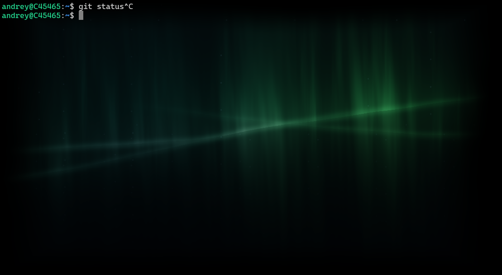

# Shader backgrounds for **Windows Terminal**

Procedural shaders (primarily auroras borealises) for the **Windows Terminal** background.  
Mostly AI-generated - different auroras are generated with different AIs.  
No background image required — the shader paints the whole sky.




Live version (of aurora_claude) on Shadertoy: <https://www.shadertoy.com/view/f3j3Wd>

## Use in Windows Terminal

In your `settings.json`, add to a profile:

```json
"experimental.pixelShaderPath": "C:\\path\\to\\aurora_claude.hlsl"
```

For the intended look, give that profile a solid black color scheme and **no**
`backgroundImage` or black background image (`"background": "#000000",`)

