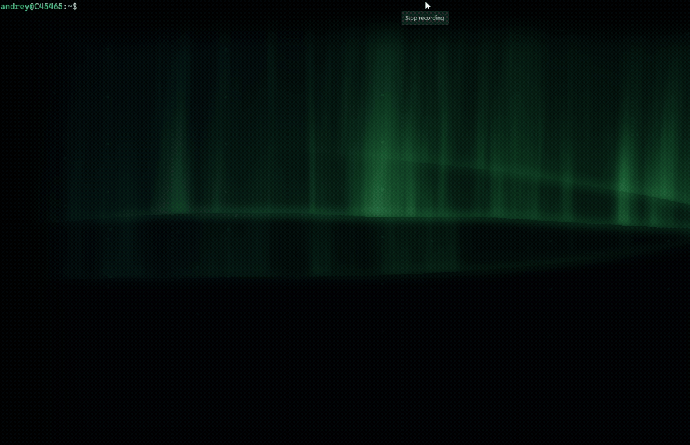
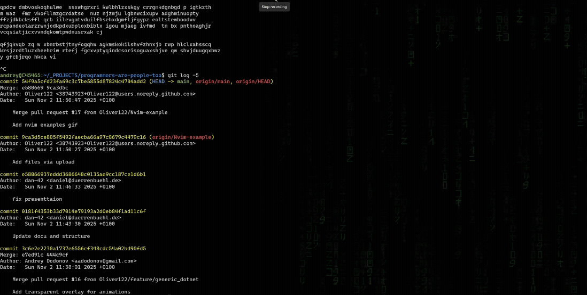

# Shader backgrounds for **Windows Terminal**

Procedural shaders (primarily auroras borealises) for the **Windows Terminal** background.  
Mostly AI-generated - different auroras are generated with different AIs.  
No background image required — the shader paints the whole sky.


**Aurora** (`aurora_claude.hlsl` and similar)


**Matrix rain** (`matrix_rain.hlsl`)



Live aurora on Shadertoy: <https://www.shadertoy.com/view/f3j3Wd>

## Use in Windows Terminal

In your `settings.json`, add to a profile:

```json
"experimental.pixelShaderPath": "C:\\path\\to\\aurora_claude.hlsl"
```

For the intended look, give that profile a solid black color scheme and **no**
`backgroundImage` or black background image (`"background": "#000000",`)

## License (this repository)

**Original work** in this repo — most AI shaders with the exceptions below. You may use, modify, and redistribute it for any
purpose (including commercial), with only the MIT attribution notice preserved.

**Excluded from MIT** (they keep their own licenses; see table below):

- `aurora_nimitz_2017.hlsl`, `aurora_nimitz_2017.glsl` — CC BY-NC-SA 3.0 (nimitz)
- `windows.hlsl` — CC BY-NC-SA 3.0 (Shadertoy default unless stated otherwise)

## Third-party shaders

The entries below are **ports or adaptations** of work published on
[Shadertoy](https://www.shadertoy.com/terms). Shadertoy’s default license (when
an author does not state another one on the shader page) is
[CC BY-NC-SA 3.0](https://creativecommons.org/licenses/by-nc-sa/3.0/).

| File(s) | Original | Author | License | What changed here |
| --- | --- | --- | --- | --- |
| `aurora_nimitz_2017.hlsl`, `aurora_nimitz_2017.glsl` | [Auroras](https://www.shadertoy.com/view/XtGGRt) | **nimitz** (2017, [@stormoid](https://twitter.com/stormoid)) | **CC BY-NC-SA 3.0** (stated in source) | GLSL kept for reference; HLSL port for Windows Terminal (`AURORA_STEPS`, Y-flip, no `iMouse`) |
| `windows.hlsl` | [Shadertoy `XstXR2`](https://www.shadertoy.com/view/XstXR2) | Credit the author shown on that Shadertoy page | **CC BY-NC-SA 3.0** unless the author chose another license on Shadertoy | GLSL → HLSL; composites under terminal text via `shaderTexture` |

**Non-commercial (`NC`):** You may use and share these shaders under CC
BY-NC-SA only for **non-commercial** purposes. Commercial use (including inside
a company product or paid service) requires permission from the original author
(nimitz allows contact for other licensing options — see comments in
`aurora_nimitz_2017.glsl`).

**Share-alike (`SA`):** If you redistribute an adapted version of
`aurora_nimitz_2017.*` or `windows.hlsl`, your distribution must use the same
license (or a compatible one) and preserve attribution.

**Technique references (not full ports):** `aurora_realistic.hlsl` and
`aurora_claude_trinoise.hlsl` reimplement their own auroras but credit noise /
marching ideas from nimitz’s Auroras; they are not copies of `aurora_nimitz_2017.*`.

### Are comments in the shader files enough?

For **CC BY-NC-SA**, attribution in each **source file** you distribute is
usually sufficient: author, link to the original, license, and a note that you
adapted it (as in the nimitz files). This README is **extra clarity** for
anyone browsing the repo who never opens every `.hlsl` file, and it documents
the **NC** limit up front. Keeping both file headers and this section is the
safest approach; headers alone are fine legally if they stay complete when you
copy or share individual files.

